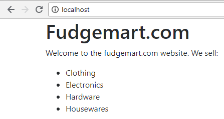
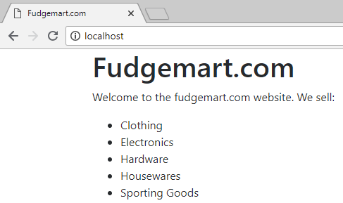
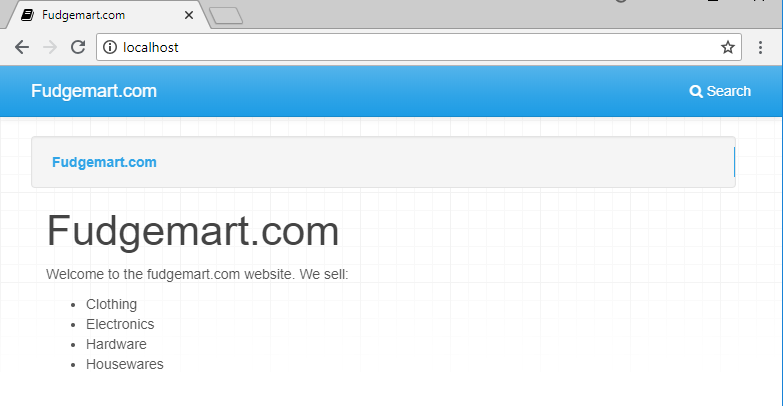
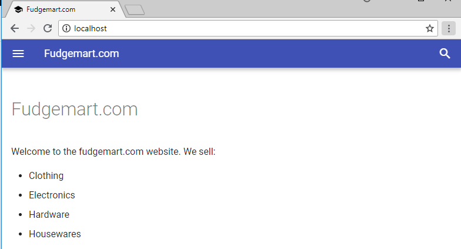

# Lab F -  Services and Application Architectures

## Learning Objectives

In this lab you will:

- Learn about multi-tier application architectures.
- Understand how to monitor and check the logs of a service.
- Understand the end-user benefits of a complex application architecture.

### Lab Setup At A Glance

In this lab, we will deploy several different setups. This time there will not be a default `docker-compose.yml` in your lab folder, but rather one for each application architecture we deploy.

This introduces the `-f` option to the `docker-compose` command to allow the user to provide a configuration in place of the standard `docker-compose.yml` file.

## Before you begin 

### Prep your lab environment. 

This lab prep's a little different as we will be scaling the workstation image to use 5 containers.

1. Open the PowerShell Prompt
2. Change the working directory folder to `ist346-labs`  
`PS > cd ist346-labs`
3. Update your git repository to the latest version:  
`PS ist346-labs> git pull origin master`
4. Change the working directory to the `lab-F` folder:  
`PS ist346-labs> cd lab-F`
5. View the Docker compose files for this lab:  
`PS ist346-labs\lab-F> dir *.yml`  
You should see `2-tier.yml`, `3-tier.yml` and `n-tier.yml` for each of the three services we will setup in this lab.


## Part 1: Two-Tier Service

In this first part we will host a static website for our made-up company, **Fudgemart.com**. We will deploy the nginx [https://www.nginx.com/](https://www.nginx.com/) server running the HTTP protocol to serve up the HTML of the homepage for the site. This is a classic example of a 2-tier client-server application architecture with web browser on your host being the client and the Docker container running the Nginx web server being the server of course.

Inside the container we will expose TCP port 80, the well-known port for the HTTP protocol to the host. This allows the web browser running on the host to have access to the Nginx web server running inside the Docker container.

You will use the `chrome` web browser on your host computer to access the web server. 

```
+-----SERVER:WEB----+
| Docker: nginx     |--+
|http://webserver:80|  |
+-------------------+  |  +--CLIENT:BROWSER---+   ++++++++++++++
                       +--|host computer      |---|  Internet  |
                          |http://localhost:80|   ++++++++++++++
                          +-------------------+
```

1. Let's bring up the environment:  
`PS ist346-labs\lab-F> docker-compose -f 2-tier.yml up -d`  
Notice how we've included `-f 2-tier.yml` to the command to specify that specific docker-compose file.
1. Let's see what's running:  
`PS ist346-labs\lab-F> docker-compose -f 2-tier.yml ps`  
The output should reveal that a container named `nginx2` is running. Furthermore the container has TCP ports 22 and 80 in use, but only port 80 is exposed to the host `0.0.0.0:80 -> 80/tcp`
1. Let's view our website:  
Open up a browser, like chrome on your host, and enter the following address: `http://localhost:80`  
1. You should see the **Fudgemart.com** website:  


### Logging

Every service has a mechanism to log requests to access resources which the service provides. This is very important as it gives administrators a complete history of attempted to access a resource.  The client has no control over the logging process, the service running on the server does it as part of its operations.

Let's view the log output in real time so we can see logging in action.

1. From your PowerShell command prompt, start another command prompt:  
`PS ist346-labs\lab-F> start powershell`
1. You will now have two powershell command prompts open. Try to arrange your windows so that you can see the website, and BOTH powershell windows. This is important as you will want to be able to view the web site and the logs at the same time. I suggest arranging your windows like this:
```
+-------------------------+
| browser    | powershell |
|            |     2      |
+------------+            |
| powershell |            |
|      1     |            |
+------------+------------+
```

3. From the `powershell 1` window, let's connect to the console of the web server:  
`PS ist346-labs\lab-F> docker-compose -f 2-tier.yml exec nginx2 bash`    
When you do this correctly, you should see the the Linux Bash prompt: `root@webserver:/#`   
4. Next, let's start watching changes to the Nginx `access.log` file. This file, as configured by the Nginx service, records all requests made to the web server by any clients. To watch the file for changes, type:  
`root@webserver:/# tail -F /var/log/nginx/access.log`   
This will keep the log file on the screen and add any new requests as they are made.
5. To try it out press the reload button in your web browser a few times. Each time you press reload, a new line is logged in the file! There's no hiding from the server!
6. Let's request a resource that's not on the server. From the `browser` enter the following address `http://localhost/hackme`  
You should see that Nginx reports **404 Not Found** back to the browser. Also in the logs you will see `404` can you find it? It's right after `"GET /hackme HTTP/1.1"` Yes, that's right, what ever you type in the browser's address bar is recorded by the server!

### What's in a log?

You might be wondering about the information you see in the log. The log is entries are in the [Common Log format](https://en.wikipedia.org/wiki/Common_Log_Format). Specifically:

1. Client IP Address `172.44.1.1` in the log you see.
1. The next two dashes `- -` represent the user identifier and logged in user requesting the document, since we are accessing without logging in, these are `- -`.
1. The date and time of the request `[11/Sep/2018:4:50:00]`
1. The actual request made, example `"GET /hackme HTTP/1.1"`, means the client made a `GET` request to the resource `/hackme` using the `HTTP/1.1` protocol.  There are different [Request Methods](https://developer.mozilla.org/en-US/docs/Web/HTTP/Methods) you can make as part of the HTTP/1.1 protocol.
1.  The HTTP [response status code](https://en.wikipedia.org/wiki/List_of_HTTP_status_codes). In this case `404` but common response codes are `200` (ok) and `304` (Not modified)
1. next you will see a number indicating the number of bytes of data sent to the client. For example with a response code of `304` the number of bytes should be `0`.
1. Finally you'll see information known as the [user-agent](https://en.wikipedia.org/wiki/User_agent). This is information the web browser sends to the web server so that it can identify which device and/or browser made the request. This user agent says `Windows NT 10.0` Indicating the request was made from a computer running Windows 10, and it says `Chrome` indicating the chrome browser was used to make the request.

All this information is recorded at each request and it's quite useful for figuring out exactly what users are doing on your website. This is the business of Web Analytics!

Keep the log watcher going as we continue with this part of the lab.

### Updating the Website

In the two-tier model, our nginx web server is just serving HTML pages to our client, as such if we want to edit the contents of this site, we must know HTML. To make things easier to change, our docker setup has exposed the folder serving the webpages to the host as `2-tier\html`. This way we do not have to connect to the console of the container to edit files and instead we can use the host. When we edit the contents of this folder, then reload the page we we should see the updated site.

Let's put that to the test.

1. From the other `powershell 2` window, let's move into the `html` folder, type:  
`PS ist346-labs\lab-F> cd 2-tier\html`
1. The command prompt will now say: `PS ist346-labs\lab-F\2-tier\html>` Let's open the `index.html` file in notepad, type:  
`PS ist346-labs\lab-F\2-tier\html> notepad index.html`
1. The `notepad` utility should open. You will see HTML markup for the webpage. We're going to edit this page and add a **Sporting Goods** department. This is a bit of a challenge because you need to know HTML to do this. Find the line that says:  
`<li>Housewares</li>`   
And add the following line beneath it: `<li>Sporting Goods</li>` so that the markup now looks like this:
```
    <li>Housewares</li>
    <li>Sporting Goods</li>
</ul>
```
4. Let's close the `notepad` utility, and make sure to save the file when you exit.
5. Go back to your `browser` and enter the website `http://localhost` you should now see an updated page with **Sporting Goods** added as a department. 

6. Also look at the log output in the `powershell 1` window. You should see `"GET /"` with a `200` status code indicating the response was OK. 
7. If you re-load the page notice the response code is once again `304` because the content was not modified.

### Clean Up Before Next Part

1. Let's get ready for the next part. Close the `powershell 1` log window.
2. From the other command prompt change back to the `lab-F` folder by moving up two folders, type:  
`PS ist346-labs\lab-F\2-tier\html> cd ..\..`
3. Tear down the 2-tier setup, type:  
`PS ist346-labs\lab-F> docker-compose -f 2-tier.yml down`

## Part 2: Three Tier Service

In this next part we will host the **Fudgemart.com** website using the [MKDocs](https://www.mkdocs.org/) static site generator. A static site generator creates HTML content from the [markdown](https://en.wikipedia.org/wiki/Markdown) format. MKDocs will handle the process of detecting changes in the content and automatically sending a reload request to any clients. Nginx, running on tcp port 80 is configured to forward requests to the MKDocs service on tcp port 8000. This is a common use case for nginx: to act as an HTTP reverse-proxy for an another HTTP service (in this case, its MKDocs).  Typically the reverse proxy configured on a public IP address and handles forwarding HTTP traffic to multiple web applications on a private network. 

What makes this example 3-Teir is we have:

1. a client, the web browser
2. a Web server, Nginx, which forwards requests on tcp 80 to the MKDocs server on port 8000
3. business logic server, MKDocs which generates the HTML on tcp 8000

```
          +----SERVER:WEB-----+
          | Docker: nginx     |---+
   +------|http://webserver:80|   |
   |      +-------------------+   |  +---CLIENT:BROWSER----+   ++++++++++++++
+----SERVER:LOGIC----+            +--| host computer       |---|  Internet  |
| Docker: MKDocs     |               | http://localhost:80 |   ++++++++++++++
| http://mkdocs:8000 |               +---------------------+
+--------------------+
```

Let's explore how this 3 tier setup works and at the same time demonstrate the advantages of markdown over the HTML format when it comes to managing content.

1. First let's bring up the environment:  
`PS ist346-labs\lab-F> docker-compose -f 3-tier.yml up -d`
1. Let's  make sure it's running:  
`PS ist346-labs\lab-F> docker-compose -f 3-tier.yml ps`  
The output should reveal that two containers are running `nginx3` exposing tcp port `80` and `mkdocs` exposing tcp port `8000`
1. Let's view our website:  
Open up a browser, like chrome on your host, and enter the following address: `http://localhost:80` 
1. You should see the **Fudgemart.com**  website:  
  
The site looks quite different! This is what the MKDocs application does for us as we will explore in a future section.

### What About The Logs?

This docker setup has the logs configured to redirect to stdout. This allows us to use `docker-compose` to inspect the logs. This is a common method of logging while you are testing your container setup.

1. To view the `nginx` logs, type:  
`PS ist346-labs\lab-F> docker-compose -f 3-tier.yml logs nginx3`    
Note that `nginx3` is the name of the container service.  
You shoud see quite a bit more information in the output because the one page we see from our `"GET /"` is actually made up of several other supporting files and scripts.  
1. Let's view the MKDocs application logs, type:  
`PS ist346-labs\lab-F> docker-compose -f 3-tier.yml logs mkdocs`   
In these load you'll see information about how the HTML (called documentation) is built from the content. 

### Content updates using MKDocs

In this section, we will explore the advantages of a business logic tier like MKDocs to update a website as opposed to simply editing HTML content directly. Once again we have exposed the contents of the website which are inside the container to a local folder, this time `3-tier\docs`.

1. Let's edit the MKDocs configuration file so we can change the theme of the website. Type:   
`PS ist346-labs\lab-F> notepad 3-tier\docs\mkdocs.yml`
1. This brings up the configuration file in the text editor. Let's switch the site theme. Edit this line:   
`name: mkdocs`  
so that it reads:  
`name: material`
1. Close the text editor and save the file. 
1. When you return to the `browser` you will see the page has reloaded automatically and there is a new site theme!  
  
How does the page load automatically? That's a feature of MKDocs. When it detects a change on the server is sends a signal to each client browser to reload the page content.
1. Let's put this to the test by adding the **Sporting Goods** department, edit the page:  
`PS ist346-labs\lab-F> notepad 3-tier\docs\docs\index.md`  
1. You will see the contents in Markdown format. To add a list item, simply add this line below  `- Housewares` :  
`- Sporting Goods` 
1. Close the text editor and save the page.
1. When you return to the browser, it will have re-loaded and **Sporting Goods** will not appear in the page content!

### Clean Up Before Next Part

1. Let's get ready for the final part. Tear down the 3-tier setup, type:  
`PS ist346-labs\lab-F> docker-compose -f 3-tier.yml down`

## Part 3: N-Tier Service

In this final part we will deploy an N-tier content/blog application, [wordpress](https://wordpress.org). Wordpress allows users to create websites without any knowledge of HTML. It's the classic example of the benefits of an N-Tier application - ease of use for the end user as the HTML is being created by the wordpress application itself based on user actions from its friendly user interface. Here's a summary of the tiers in this setup.

1. a client, the web browser
2. a Web server, Nginx, which forwards requests on tcp 80 to the Wordpress server on port 8080
3. Wordpress, the business logic application which makes managing a website easy and simple, running on tcp port 8080.
4. Mysql, the database layer where the application stores content and changes, running on port tcp 3306. The wordpress application talks to the database over this port.

1. First let's bring up the environment:  
`PS ist346-labs\lab-F> docker-compose -f n-tier.yml up -d`
1. Let's  make sure it's running:  
`PS ist346-labs\lab-F> docker-compose -f n-tier.yml ps`  
The output should reveal three containers are running `nginxn` exposing tcp port `80` and `wordpress` exposing tcp port `8080` and `mysql` exposing tcp `3306`.
1. Load the wordpress site in your browser, type: `http://localhost`.   
Please note it takes some time for the application to initialize. If you go to localhost and get an nginx error, please reload the page until you see the worpress setup. 
1. Follow the prompts for the wordpress setup.  
Site Title: **Fudgemart.com**  
Username: **admin**  
Password: **IST346**  
Confirm use of weak password: **Checked**  
Email: **mafudge@syr.edu**  
Search Engine Visibility: **Checked**  
Click `Install Wordpress`
1. Login as **admin** with password **IST346** 
1. You are now logged into wordpress.

At this point you are encouraged to play around! If you screw things up you can always tear down the environment and bring it back up again. Some things to try:

1. Create a post and publish it.
1. Change the theme of the site
1. Edit the layout of the theme.

### Clean Up

1. To bring down the environment, Type:  
`PS ist346-labs\lab-F> docker-compose -f n-tier.yml down`

## Questions 

1. What does the `-f` option do to the `docker-compose` command?
1. What is logging and why is it important for any running service?
1. If you type `snickers bars` into your favorite search engine, is that information being logged? Based on what you learned in this lab, do you know this?
1. Does a web server log your activity when your browser is in private or incognito mode?
1. What is an HTTP reverse proxy? Why is it used?
1. What is Markdown? What is Markdown's relationship to HTML?
1. What are the advantages of a site generator like MKDocs versus an static HTML site?
1. Type the `docker-compose` command to view the `mysql` logs from the `n-tier` example.
1. What are the advantage(s) of a system like wordpress over a static HTML website?
1. What determines whether an application is 2-tier, 3-tier or n-tier?
